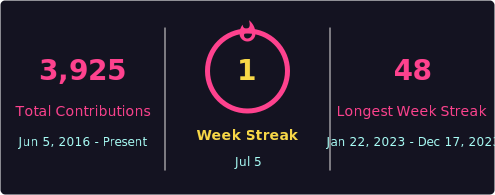

<h1 align="center">I'm Fadi Asaad</h1>

Passionate software engineer and tech enthusiast diving deep into the realms of software engineering.

⚡ A fact about me: **I love diving deep into the mechanics of technology and understanding how things work under the hood**

  <h3>Connect with me:&nbsp;&nbsp;
    
  </h3>

<h3 align="left">Languages and Tools: I use Arch BTW 😜</h3>

   
   
  

## 🏆 GitHub Trophies

## Favorite Projects
[](https://github.com/Davenchy/live-torrent-backend)
[](https://github.com/Davenchy/media-share)
[](https://github.com/Davenchy/clayout)
[](https://github.com/Davenchy/brainfuck_compiler.rs)
[](https://github.com/Davenchy/qemu-arm-machine)
[](https://github.com/Davenchy/rusty_battleship)
[](https://github.com/Davenchy/service_generator)
[](https://github.com/Davenchy/pc-remote)
[](https://github.com/Davenchy/hotclip)
[](https://github.com/Davenchy/timer_sh)

## 📊 GitHub Stats:

  
   
   
  

