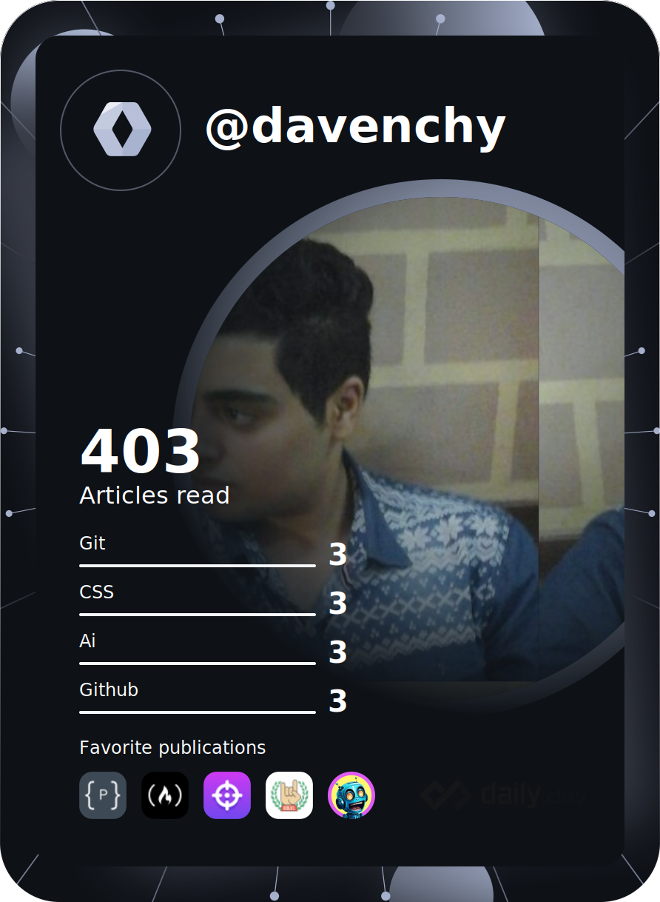

<p align="center"></p>
<h1 align="center">Hi 👋, I'm Davenchy</h1>
<h3 align="center">A passionate software engineer</h3>

<hr />

- 🌱 I’m currently learning **Software Engineering @ALX_Africa/Embedded Linux with Eng. Moatasem El-Sayed**

- ⚡ A fact about me: **I think I like to know how things work under the hood**

## About Me

Hi there! I'm Fadi Asaad, a curious learner who loves exploring different tech areas. I enjoy figuring out how things work by creating my tools. My dream? A future where we use VR Glasses every day, powered by AI. Let's journey into this tech world together! 👨‍💻✨ #TechExplorer #Dreamer #AI #VR

<a href="https://app.daily.dev/Davenchy" style="display: block">
 </a>

<h3 align="left">Connect with me:</h3>
<div align="center">
<a href="https://www.hackerrank.com/profile/Davenchy" target="blank"></a>
<a href="https://codepen.io/davenchy" target="blank"></a>
<a href="https://dev.to/fadi_davenchy" target="blank"></a>
<a href="https://twitter.com/fadi_davenchy" target="blank"></a>
<a href="https://linkedin.com/in/fadi-asaad" target="blank"></a>
<a href="https://stackoverflow.com/users/8046862" target="blank"></a>
<a href="https://codesandbox.com/davenchy" target="blank"></a>
<a href="https://fb.com/davenchy16" target="blank"></a>
<a href="https://hashnode.com/@davenchy" target="blank"></a>
<a href="https://discord.gg/1525" target="blank"></a>
</div>

<!--
## 💻 Tech Stack:
                           	       
-->

<h3 align="left">Languages and Tools:</h3>
<div align="center">
 <a href="https://www.linux.org/" target="_blank" rel="noreferrer">  </a>
<a href="https://www.gnu.org/software/bash/" target="_blank" rel="noreferrer">  </a>
<a href="https://git-scm.com/" target="_blank" rel="noreferrer">  </a> 
<a href="https://www.python.org" target="_blank" rel="noreferrer">  </a>
 <a href="https://www.sqlite.org/" target="_blank" rel="noreferrer">  </a>
<a href="https://www.cprogramming.com/" target="_blank" rel="noreferrer">  </a>
 <a href="https://www.w3schools.com/cpp/" target="_blank" rel="noreferrer">  </a>
 <a href="https://flutter.dev" target="_blank" rel="noreferrer">  </a>
 <a href="https://dart.dev" target="_blank" rel="noreferrer">  </a>
<a href="https://www.figma.com/" target="_blank" rel="noreferrer">  </a>
 <a href="https://firebase.google.com/" target="_blank" rel="noreferrer">  </a>
 <a href="https://www.w3.org/html/" target="_blank" rel="noreferrer">  </a>
<a href="https://www.w3schools.com/css/" target="_blank" rel="noreferrer">  </a>
 <a href="https://developer.mozilla.org/en-US/docs/Web/JavaScript" target="_blank" rel="noreferrer">  </a>
<a href="https://reactjs.org/" target="_blank" rel="noreferrer">  </a>
 <a href="https://tailwindcss.com/" target="_blank" rel="noreferrer">  </a>
 <a href="https://www.typescriptlang.org/" target="_blank" rel="noreferrer">  </a> 
 <a href="https://www.mongodb.com/" target="_blank" rel="noreferrer">  </a>
 <a href="https://nodejs.org" target="_blank" rel="noreferrer">  </a>
 <a href="https://expressjs.com" target="_blank" rel="noreferrer">  </a>
 <a href="https://postman.com" target="_blank" rel="noreferrer">  </a>
<a href="https://www.lua.org/" target="_blank" rel="noreferrer">  </a>
 <a href="https://www.arduino.cc/" target="_blank" rel="noreferrer">  </a>
<a href="https://www.blender.org/" target="_blank" rel="noreferrer">  </a>
</div>

## 🏆 GitHub Trophies


## Favorite Projects

[](https://github.com/Davenchy/service_generator)
[](https://github.com/Davenchy/agent-ai)
[](https://github.com/Davenchy/zellij-wrapper)
[](https://github.com/Davenchy/pc-remote)
[](https://github.com/Davenchy/hotclip)
[](https://github.com/Davenchy/ping_pong_cpp)
[](https://github.com/Davenchy/garbage_free_c)
[](https://github.com/Davenchy/utm)
[](https://github.com/Davenchy/live-torrent) 
[](https://github.com/Davenchy/smart_controller)
[](https://github.com/Davenchy/stop_watch_app)
[](https://github.com/Davenchy/weather_app)
[](https://github.com/Davenchy/news_app)
[](https://github.com/Davenchy/rock_paper_scissors)
[](https://github.com/Davenchy/xo_flutter_game)
[](https://github.com/Davenchy/bool_quizzes)
 
## 📊 GitHub Stats:

<div align="center">


<br/>
 

 <br/>

 <br/>

 </div>

<hr/>

<!--START_SECTION:waka-->


**🐱 My GitHub Data** 

> 📦 136.7 kB Used in GitHub's Storage 
 > 
> 💼 Opted to Hire
 > 
> 📜 94 Public Repositories 
 > 
> 🔑 2 Private Repositories 
 > 
**I'm a Night 🦉** 

```text
🌞 Morning                692 commits         ███░░░░░░░░░░░░░░░░░░░░░░   13.95 % 
🌆 Daytime                1140 commits        ██████░░░░░░░░░░░░░░░░░░░   22.98 % 
🌃 Evening                1660 commits        ████████░░░░░░░░░░░░░░░░░   33.47 % 
🌙 Night                  1468 commits        ███████░░░░░░░░░░░░░░░░░░   29.60 % 
```
📅 **I'm Most Productive on Sunday** 

```text
Monday                   708 commits         ████░░░░░░░░░░░░░░░░░░░░░   14.27 % 
Tuesday                  575 commits         ███░░░░░░░░░░░░░░░░░░░░░░   11.59 % 
Wednesday                542 commits         ███░░░░░░░░░░░░░░░░░░░░░░   10.93 % 
Thursday                 646 commits         ███░░░░░░░░░░░░░░░░░░░░░░   13.02 % 
Friday                   754 commits         ████░░░░░░░░░░░░░░░░░░░░░   15.20 % 
Saturday                 724 commits         ████░░░░░░░░░░░░░░░░░░░░░   14.60 % 
Sunday                   1011 commits        █████░░░░░░░░░░░░░░░░░░░░   20.38 % 
```


📊 **This Week I Spent My Time On** 

```text
🕑︎ Time Zone: Africa/Cairo

💬 Programming Languages: 
C++                      6 hrs 51 mins       ██████████░░░░░░░░░░░░░░░   40.97 % 
C                        4 hrs 55 mins       ███████░░░░░░░░░░░░░░░░░░   29.38 % 
Objective-C              1 hr 7 mins         ██░░░░░░░░░░░░░░░░░░░░░░░   06.74 % 
Vim Script               1 hr 7 mins         ██░░░░░░░░░░░░░░░░░░░░░░░   06.68 % 
JavaScript               48 mins             █░░░░░░░░░░░░░░░░░░░░░░░░   04.86 % 

🔥 Editors: 
Vim                      16 hrs 35 mins      █████████████████████████   99.17 % 
Unknown Editor           8 mins              ░░░░░░░░░░░░░░░░░░░░░░░░░   00.83 % 

🐱‍💻 Projects: 
Unknown Project          16 hrs 4 mins       ████████████████████████░   96.07 % 
torrify                  22 mins             █░░░░░░░░░░░░░░░░░░░░░░░░   02.19 % 
alx-backend-javascript   11 mins             ░░░░░░░░░░░░░░░░░░░░░░░░░   01.16 % 
coc.nvim                 5 mins              ░░░░░░░░░░░░░░░░░░░░░░░░░   00.58 % 

💻 Operating System: 
Linux                    16 hrs 43 mins      █████████████████████████   100.00 % 
```

**I Mostly Code in Dart** 

```text
C                        14 repos            ████░░░░░░░░░░░░░░░░░░░░░   17.07 % 
Python                   12 repos            ████░░░░░░░░░░░░░░░░░░░░░   14.63 % 
JavaScript               12 repos            ████░░░░░░░░░░░░░░░░░░░░░   14.63 % 
Shell                    7 repos             ██░░░░░░░░░░░░░░░░░░░░░░░   08.54 % 
C++                      3 repos             █░░░░░░░░░░░░░░░░░░░░░░░░   03.66 % 
```


**Timeline**


 Last Updated on 17/04/2024 01:12:25 UTC
<!--END_SECTION:waka-->

## Recent Activity
<!--START_SECTION:activity-->
`[04/18 01:09]`  Made `7` commits in [Davenchy/alx-backend-javascript](https://github.com/Davenchy/alx-backend-javascript)  
`[04/17 01:12]`  Made `1` commit in [Davenchy/Davenchy](https://github.com/Davenchy/Davenchy)  
`[04/16 12:54]`  Made `1` commit in [Davenchy/domain_to_ipv4_c](https://github.com/Davenchy/domain_to_ipv4_c)  
`[04/16 12:50]`  Created branch [`main`](https://github.com/Davenchy/domain_to_ipv4_c/tree/main) in [Davenchy/domain_to_ipv4_c](https://github.com/Davenchy/domain_to_ipv4_c)  
`[04/16 12:49]`  Created repository [Davenchy/domain_to_ipv4_c](https://github.com/Davenchy/domain_to_ipv4_c)  
`[04/16 01:11]`  Made `1` commit in [Davenchy/Davenchy](https://github.com/Davenchy/Davenchy)  
`[04/15 05:53]`  Made `2` commits in [Davenchy/alx-interview](https://github.com/Davenchy/alx-interview)  
`[04/15 05:50]`  Made `14` commits in [Davenchy/alx-backend-javascript](https://github.com/Davenchy/alx-backend-javascript)  
`[04/15 03:30]`  Made `3` commits in [Davenchy/Davenchy](https://github.com/Davenchy/Davenchy)  
`[04/11 18:26]`  Made `14` commits in [Davenchy/alx-backend-javascript](https://github.com/Davenchy/alx-backend-javascript)  

<details><summary>Show More</summary>

`[04/11 01:12]`  Made `1` commit in [Davenchy/Davenchy](https://github.com/Davenchy/Davenchy)  
`[04/10 23:44]`  Created branch [`main`](https://github.com/Davenchy/torrify/tree/main) in [Davenchy/torrify](https://github.com/Davenchy/torrify)  
`[04/10 23:44]`  Created repository [Davenchy/torrify](https://github.com/Davenchy/torrify)  
`[04/10 01:11]`  Made `1` commit in [Davenchy/Davenchy](https://github.com/Davenchy/Davenchy)  
`[04/09 03:21]`  Made `13` commits in [Davenchy/alx-backend-javascript](https://github.com/Davenchy/alx-backend-javascript)  
`[04/09 01:12]`  Made `1` commit in [Davenchy/Davenchy](https://github.com/Davenchy/Davenchy)  
`[04/08 15:30]`  Made `3` commits in [Davenchy/alx-interview](https://github.com/Davenchy/alx-interview)  
`[04/08 15:26]`  Made `1` commit in [Davenchy/alx-backend-javascript](https://github.com/Davenchy/alx-backend-javascript)  
`[04/08 15:23]`  Created branch [`main`](https://github.com/Davenchy/alx-interview/tree/main) in [Davenchy/alx-interview](https://github.com/Davenchy/alx-interview)  
`[04/08 15:23]`  Created repository [Davenchy/alx-interview](https://github.com/Davenchy/alx-interview)  
`[04/08 15:18]`  Made `17` commits in [Davenchy/alx-backend-javascript](https://github.com/Davenchy/alx-backend-javascript)  
`[04/08 14:58]`  Created branch [`main`](https://github.com/Davenchy/alx-backend-javascript/tree/main) in [Davenchy/alx-backend-javascript](https://github.com/Davenchy/alx-backend-javascript)  
`[04/08 14:58]`  Created repository [Davenchy/alx-backend-javascript](https://github.com/Davenchy/alx-backend-javascript)  
`[04/08 01:12]`  Made `11` commits in [Davenchy/Davenchy](https://github.com/Davenchy/Davenchy)  
`[03/28 16:13]`  Closed issue [`#218`](https://github.com//dart-lang/native/issues/218 'LibTorrent bindings') in [dart-lang/native](https://github.com/dart-lang/native)  
`[03/28 01:10]`  Made `1` commit in [Davenchy/Davenchy](https://github.com/Davenchy/Davenchy)  
`[03/27 19:58]`  Commented on [`#218`](https://github.com//dart-lang/native/issues/218 'LibTorrent bindings') in [dart-lang/native](https://github.com/dart-lang/native)  
`[03/27 19:58]`  Reopened issue [`#218`](https://github.com//dart-lang/native/issues/218 'LibTorrent bindings') in [dart-lang/native](https://github.com/dart-lang/native)  
`[03/27 03:43]`  Made `1` commit in [Davenchy/libtorrent-dart-bindings-example](https://github.com/Davenchy/libtorrent-dart-bindings-example)  
`[03/27 03:32]`  Closed issue [`#218`](https://github.com//dart-lang/native/issues/218 'LibTorrent bindings') in [dart-lang/native](https://github.com/dart-lang/native)  
`[03/27 03:32]`  Commented on [`#218`](https://github.com//dart-lang/native/issues/218 'LibTorrent bindings') in [dart-lang/native](https://github.com/dart-lang/native)  
`[03/27 03:32]`  Reopened issue [`#218`](https://github.com//dart-lang/native/issues/218 'LibTorrent bindings') in [dart-lang/native](https://github.com/dart-lang/native)  
`[03/27 03:30]`  Made `2` commits in [Davenchy/libtorrent-dart-bindings-example](https://github.com/Davenchy/libtorrent-dart-bindings-example)  
`[03/27 03:18]`  Created branch [`main`](https://github.com/Davenchy/libtorrent-dart-bindings-example/tree/main) in [Davenchy/libtorrent-dart-bindings-example](https://github.com/Davenchy/libtorrent-dart-bindings-example)  
`[03/27 03:17]`  Created repository [Davenchy/libtorrent-dart-bindings-example](https://github.com/Davenchy/libtorrent-dart-bindings-example)  
`[03/27 01:10]`  Made `1` commit in [Davenchy/Davenchy](https://github.com/Davenchy/Davenchy)  
`[03/26 18:21]`  Commented on [`#218`](https://github.com//dart-lang/native/issues/218 'LibTorrent bindings') in [dart-lang/native](https://github.com/dart-lang/native)  
`[03/26 18:08]`  Commented on [`#218`](https://github.com//dart-lang/native/issues/218 'LibTorrent bindings') in [dart-lang/native](https://github.com/dart-lang/native)  
`[03/26 01:10]`  Made `9` commits in [Davenchy/Davenchy](https://github.com/Davenchy/Davenchy)  
`[03/17 20:21]`  Commented on [`#2`](https://github.com//Davenchy/general_json_rpc/issues/2 'Q: what permission are needed to run server on the phone?') in [Davenchy/general_json_rpc](https://github.com/Davenchy/general_json_rpc)  
`[03/17 20:21]`  Closed issue [`#2`](https://github.com//Davenchy/general_json_rpc/issues/2 'Q: what permission are needed to run server on the phone?') in [Davenchy/general_json_rpc](https://github.com/Davenchy/general_json_rpc)  
`[03/17 01:14]`  Made `24` commits in [Davenchy/Davenchy](https://github.com/Davenchy/Davenchy)  
`[02/21 08:03]`  Commented on [`#1466`](https://github.com//phhusson/treble_experimentations/issues/1466 'system  images too large for my device. (umidigi a7 pro)') in [phhusson/treble_experimentations](https://github.com/phhusson/treble_experimentations)  
`[02/21 01:10]`  Made `11` commits in [Davenchy/Davenchy](https://github.com/Davenchy/Davenchy)  
`[02/10 04:26]`  Starred [abigaliz/krustyfy](https://github.com/abigaliz/krustyfy)  
`[02/10 04:19]`  Made `1` commit in [Davenchy/deadd_control](https://github.com/Davenchy/deadd_control)  
`[02/10 04:18]`  Made `3` commits in [Davenchy/ppm-canvas-c](https://github.com/Davenchy/ppm-canvas-c)  
`[02/10 04:12]`  Created branch [`main`](https://github.com/Davenchy/ppm-canvas-c/tree/main) in [Davenchy/ppm-canvas-c](https://github.com/Davenchy/ppm-canvas-c)  
`[02/10 04:11]`  Created repository [Davenchy/ppm-canvas-c](https://github.com/Davenchy/ppm-canvas-c)  
`[02/10 01:13]`  Made `1` commit in [Davenchy/deadd_control](https://github.com/Davenchy/deadd_control)  
`[02/10 01:08]`  Made `1` commit in [Davenchy/Davenchy](https://github.com/Davenchy/Davenchy)  
`[02/10 00:37]`  Made `3` commits in [Davenchy/deadd_control](https://github.com/Davenchy/deadd_control)  
`[02/10 00:16]`  Created branch [`main`](https://github.com/Davenchy/deadd_contorl/tree/main) in [Davenchy/deadd_contorl](https://github.com/Davenchy/deadd_contorl)  
`[02/10 00:16]`  Created repository [Davenchy/deadd_contorl](https://github.com/Davenchy/deadd_contorl)  
`[02/08 01:09]`  Made `4` commits in [Davenchy/Davenchy](https://github.com/Davenchy/Davenchy)  
`[02/04 05:37]`  Starred [home-assistant/core](https://github.com/home-assistant/core)  
`[02/04 04:45]`  Starred [h2oai/h2ogpt](https://github.com/h2oai/h2ogpt)  
`[02/04 04:23]`  Starred [rhasspy/piper](https://github.com/rhasspy/piper)  
`[02/04 01:14]`  Made `2` commits in [Davenchy/Davenchy](https://github.com/Davenchy/Davenchy)  
`[02/02 08:51]`  Made `6` commits in [Davenchy/astronvim-config](https://github.com/Davenchy/astronvim-config)  
`[02/02 05:17]`  Starred [catppuccin/nvim](https://github.com/catppuccin/nvim)  
`[02/02 04:44]`  Made `3` commits in [Davenchy/astronvim-config](https://github.com/Davenchy/astronvim-config)  
`[02/02 03:28]`  Starred [jackMort/ChatGPT.nvim](https://github.com/jackMort/ChatGPT.nvim)  
`[02/01 02:26]`  Starred [openlm-research/open_llama](https://github.com/openlm-research/open_llama)  
`[02/01 02:06]`  Made `2` commits in [Davenchy/agent-ai](https://github.com/Davenchy/agent-ai)  
`[02/01 01:33]`  Made `1` commit in [Davenchy/linux-bot](https://github.com/Davenchy/linux-bot)  
`[02/01 01:31]`  Made `1` commit in [Davenchy/hotclip](https://github.com/Davenchy/hotclip)  
`[02/01 01:16]`  Made `2` commits in [Davenchy/agent-ai](https://github.com/Davenchy/agent-ai)  
`[02/01 01:14]`  Made `1` commit in [Davenchy/Davenchy](https://github.com/Davenchy/Davenchy)  
`[02/01 01:01]`  Made `3` commits in [Davenchy/agent-ai](https://github.com/Davenchy/agent-ai)  
`[02/01 00:47]`  Made `1` commit in [Davenchy/Davenchy](https://github.com/Davenchy/Davenchy)  
`[02/01 00:45]`  Made `5` commits in [Davenchy/agent-ai](https://github.com/Davenchy/agent-ai)  
`[01/31 01:10]`  Made `1` commit in [Davenchy/Davenchy](https://github.com/Davenchy/Davenchy)  
`[01/30 03:42]`  Made `4` commits in [Davenchy/agent-ai](https://github.com/Davenchy/agent-ai)  
`[01/30 03:19]`  Created branch [`main`](https://github.com/Davenchy/agent-ai/tree/main) in [Davenchy/agent-ai](https://github.com/Davenchy/agent-ai)  
`[01/30 03:18]`  Created repository [Davenchy/agent-ai](https://github.com/Davenchy/agent-ai)  
`[01/30 01:10]`  Made `1` commit in [Davenchy/Davenchy](https://github.com/Davenchy/Davenchy)  
`[01/29 05:18]`  Made `4` commits in [Davenchy/alx-interview](https://github.com/Davenchy/alx-interview)  
`[01/29 01:10]`  Made `1` commit in [Davenchy/Davenchy](https://github.com/Davenchy/Davenchy)  
`[01/28 03:57]`  Commented on [`#119`](https://github.com//Davenchy/live-torrent/issues/119 'Status') in [Davenchy/live-torrent](https://github.com/Davenchy/live-torrent)  
`[01/28 03:57]`  Closed issue [`#119`](https://github.com//Davenchy/live-torrent/issues/119 'Status') in [Davenchy/live-torrent](https://github.com/Davenchy/live-torrent)  
`[01/28 01:15]`  Made `6` commits in [Davenchy/Davenchy](https://github.com/Davenchy/Davenchy)  
`[01/23 00:27]`  Starred [openai/whisper](https://github.com/openai/whisper)  
`[01/22 01:19]`  Made `1` commit in [Davenchy/Davenchy](https://github.com/Davenchy/Davenchy)  
`[01/21 21:13]`  Made `21` commits in [Davenchy/linux-bot](https://github.com/Davenchy/linux-bot)  
`[01/21 11:47]`  Created branch [`main`](https://github.com/Davenchy/linux-bot/tree/main) in [Davenchy/linux-bot](https://github.com/Davenchy/linux-bot)  
`[01/21 11:45]`  Created repository [Davenchy/linux-bot](https://github.com/Davenchy/linux-bot)  
`[01/21 01:21]`  Made `3` commits in [Davenchy/Davenchy](https://github.com/Davenchy/Davenchy)  
`[01/19 00:12]`  Starred [dessant/search-by-image](https://github.com/dessant/search-by-image)  
`[01/18 01:15]`  Made `1` commit in [Davenchy/Davenchy](https://github.com/Davenchy/Davenchy)  

</details>
<!--END_SECTION:activity-->

## ✍️ Random Dev Quote
<p align="center"></p>

## 💰 You can help me by Donating
<p align="center">
<a target="blank" href="https://buymeacoffee.com/davenchy"></a>
<a target="blank" href="https://ko-fi.com/davenchy"></a>
</p>
